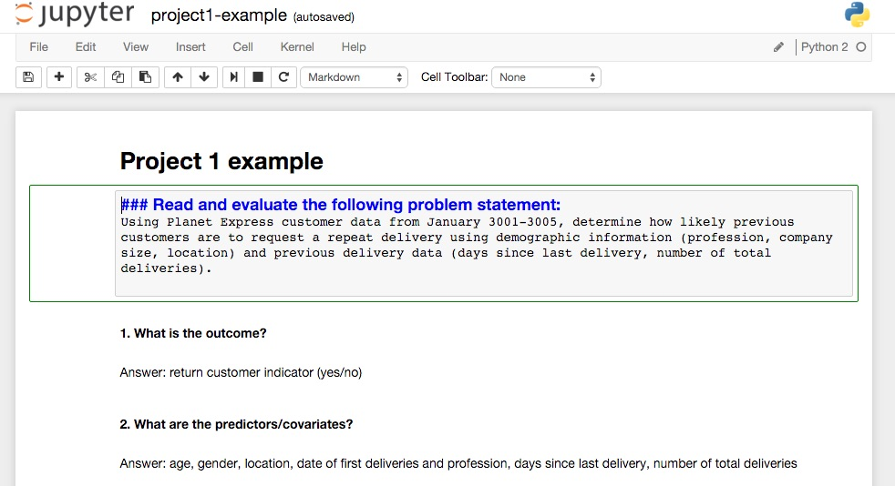

#  DS-SF-23 | Unit Project 1: Research Design Write-Up

> **Deadline:** Thursday, May 12, 2016 6:30PM Pacific Time.
>
> **Submission:**
>
> - Please submit your project via GitHub and send a private message on Slack to Bob and Ivan with a link to it.

---

## PROMPT

"A problem well-stated is half-solved" -- Charles Kettering

Welcome to Data Science!  In this first project you will create a framework to scope out data science projects.  This framework will provide you with a guide to develop a well-articulated problem statement and analysis plan that will be robust and reproducible.

**Goal:** Create a structured iPython notebook using markup.

---

## DELIVERABLES

### Completed iPython Notebook

- **Requirements:**
  - Identify features of the dataset, including the outcome and covariates/predictors.
  - Create a data dictionary with classification of available variables.
  - Write a high quality problem statement.
  - State the risks and assumptions of your data.
  - Outline exploratory analysis methods.

- **Bonus:**
  - Practice writing an alternative problem statement for your dataset.
  - Articulate the risks and assumptions of this alternative model.

---

## RESOURCES

### Dataset

The dataset is available [here](../dataset).

### Starter code

For this project we will be using an iPython notebook.  Notebooks are a handy way to communicate your research with your team and share your analysis.  Using markup syntax will allow you create more visually appealing notebooks.

* Open the [starter code notebook](./code/unit-project-1-starter-code.ipynb) in Anaconda.

### Sample Deliverables

Check out the [sample notebook](./code/unit-project-1-sample.ipynb), which includes a data dictionary and responses to questions.  Wonder how to format your notebook the same way?  Simply double-click on any section to view the markdown.

### Suggestions for Getting Started

- Get used to the iPython Notebook layout.  Play around with keyboard shortcuts.
- Try out basic markdown for commonly used formats; look up commands for headers, bold, italic, tables.
- **Read the docs for iPython Notebooks.**  Most of the time, there is a tutorial that you can follow, but not always, and learning to read documentation is crucial to your success as a data scientist!

### Additional Links

- [iPython Notebook Shortcuts](https://ipython.org/ipython-doc/1/interactive/notebook.html#keyboard-shortcuts)
- [Markdown Cheat Sheet](https://github.com/adam-p/markdown-here/wiki/Markdown-Cheatsheet)
- [iPython Notebook Docs](http://ipython.readthedocs.org/en/stable/)

---

## EVALUATION

The rubric is available [here](./rubric).
